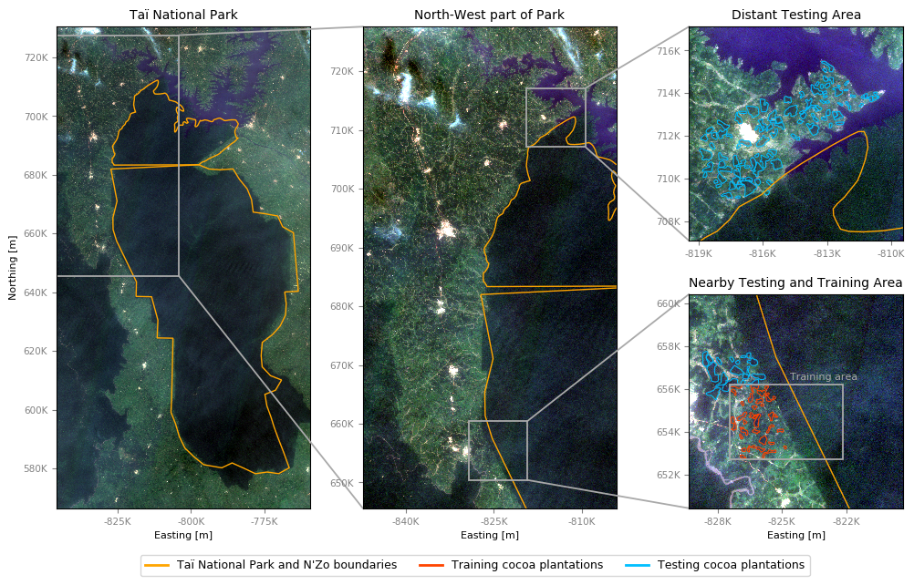
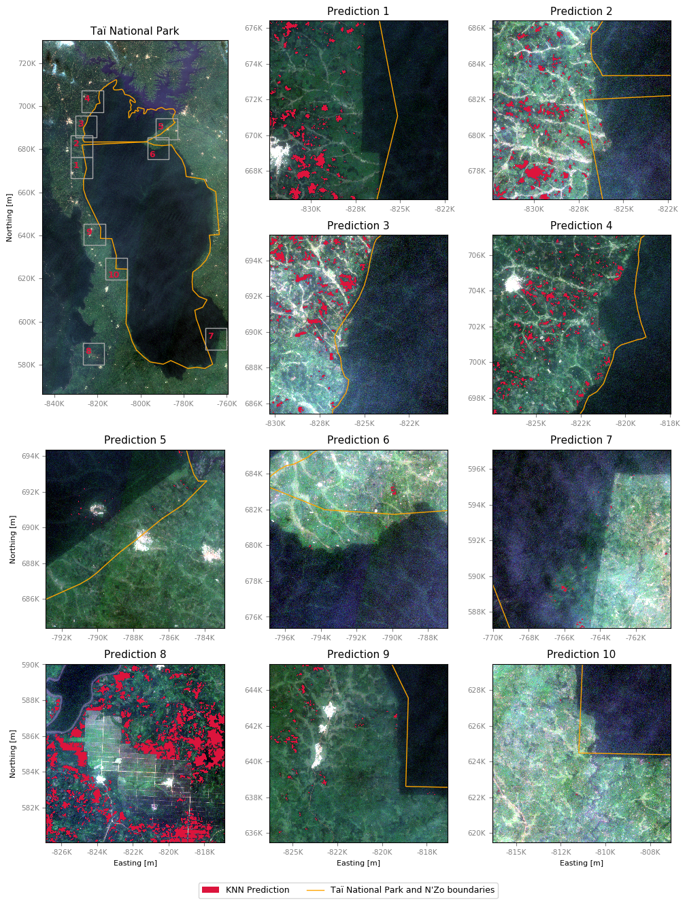

# Detecting cocoa plantation in Ivory coast

In the context of the _Image Processing for Earth Observation_ EPFL course (ENV-540)

***

## Goal
In the context of climate crisis we are facing, deforestation is an ever increasing problem, destroying precious carbon dioxide intake. In Ivory coast, the deforestation has reached an impressive magnitude mainly for cocoa plantations. As a results only few places of wild forest remains among which the Taï national park, situated South-West of the country close to the border with Liberia. This 3300 km2 protected area is a refuge for a multitude of species. Preserving it is thus an important challenge. The present project propose a machine learning approach based on remote sensing images. The goal is to build a classifier able to decide whether a pixel from Sentinel-2 image belongs to a coca plantations.

## Data

The classifier is developed on the free Sentinel-2 L1C images dated of the 29 of December 2018 (a day without clouds over the whole park). The Sentinel-2 images have 13 bands (4 at 10 meter resolution, 6 at 20 meters, and 3 at 60 meters resolution) that goes from the visible spectrum to the infrared.

The model is trained on a small area in which there are known plantations (cf Figure [Overview](#overview)). The training area have been completely labeled for the binary problem : plantation vs no plantation using the high resolution images from Google Earth. Other _testing_ areas have been labeled for *some* known plantation. Those labeled area will be used to test if the classifier generalize over space. 

## Method

## Results

