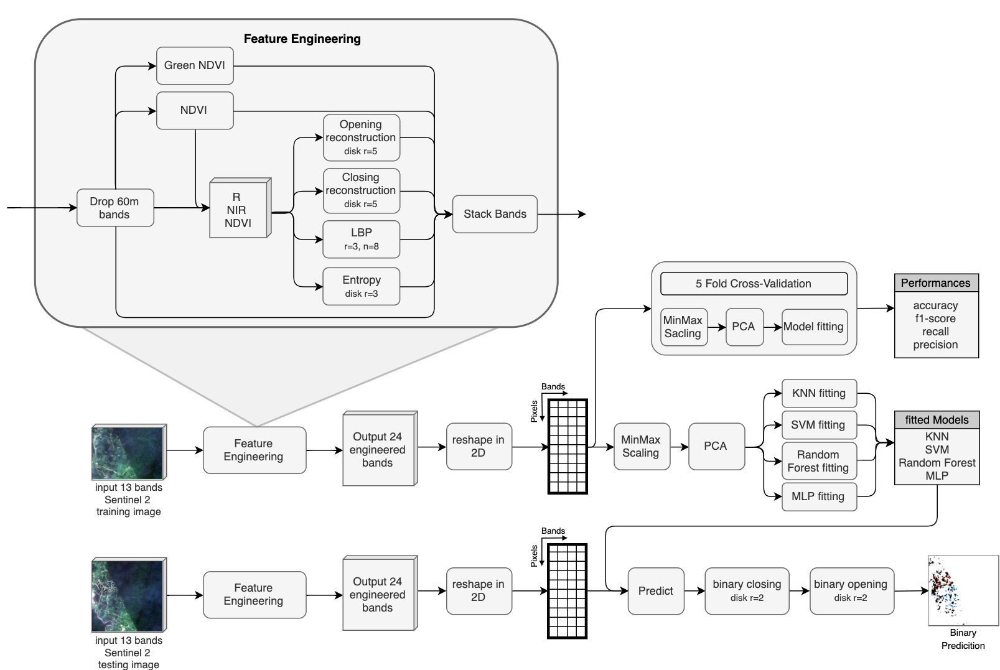
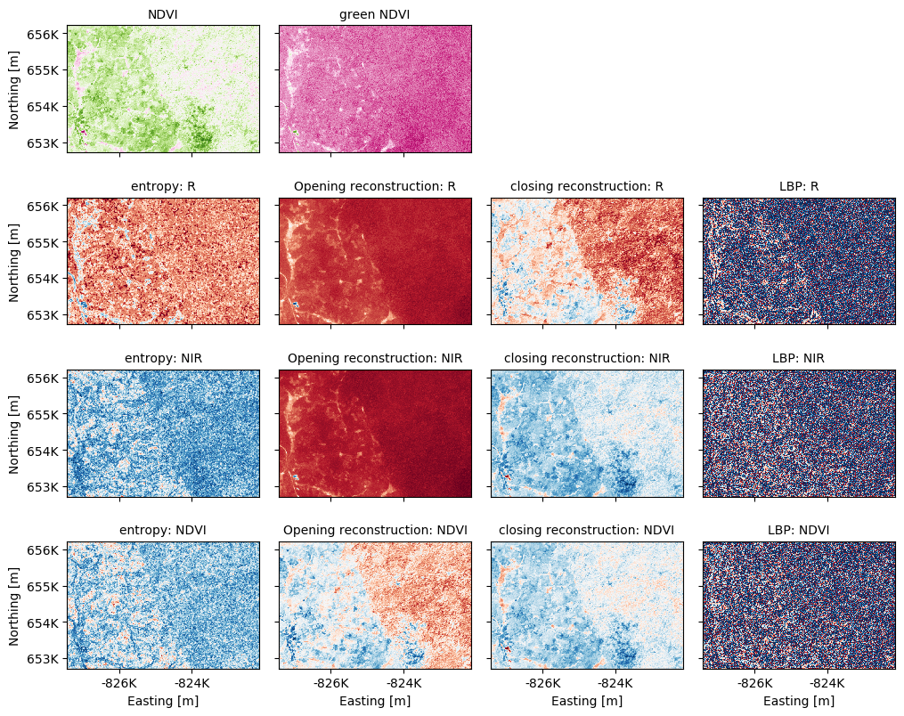
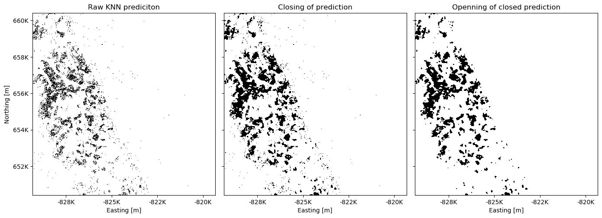
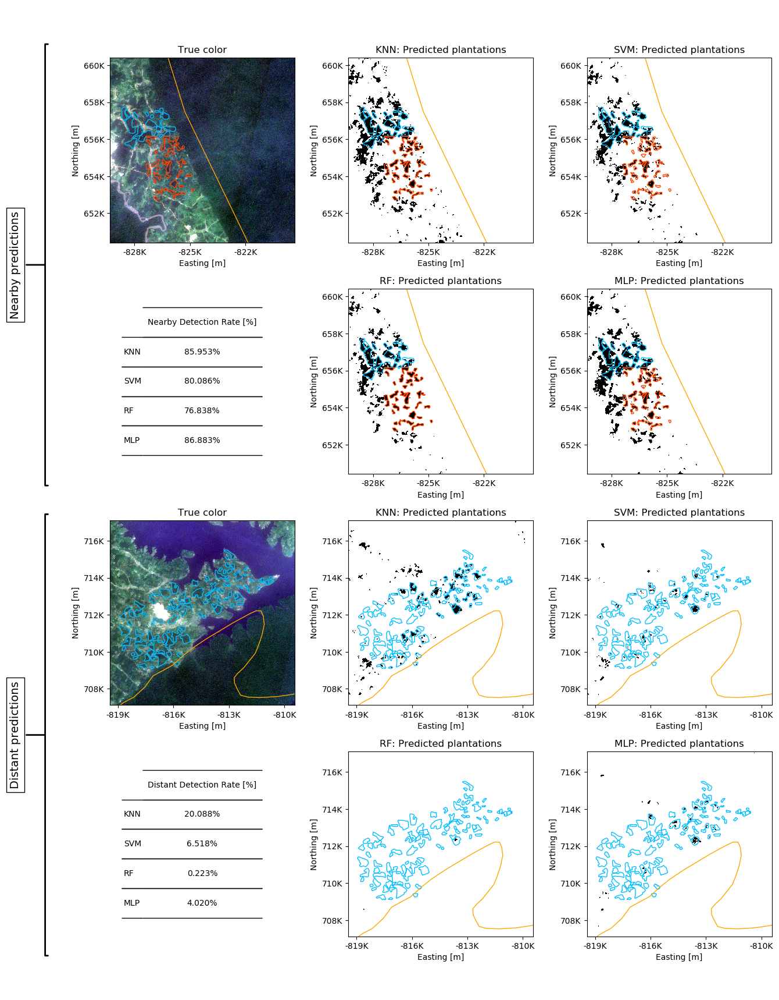

# Detecting cocoa plantation in Ivory coast

In the context of the _Image Processing for Earth Observation_ EPFL course (ENV-540)

___

## Goal
In the context of climate crisis we are facing, deforestation is an ever increasing problem, destroying precious carbon dioxide intake. In Ivory coast, the deforestation has reached an impressive magnitude mainly for cocoa plantations. As a results only few places of wild forest remains among which the Taï national park, situated South-West of the country close to the border with Liberia. This 3300 km2 protected area is a refuge for a multitude of species. Preserving it is thus an important challenge. The present project propose a machine learning approach based on remote sensing images. The goal is to build a classifier able to decide whether a pixel from Sentinel-2 image belongs to a coca plantations.

## Data

The classifier is developed on the free Sentinel-2 L1C images dated of the 29 of December 2018 (a day without clouds over the whole park). The Sentinel-2 images have 13 bands (4 at 10 meter resolution, 6 at 20 meters, and 3 at 60 meters resolution) that goes from the visible spectrum to the infrared.

|  Platform  | Sensor |   source   | Acquisition method |          Acquisition Date         | Resolution Spatial | Resolution Spectral | Resolution Radiometric |    CRS    | Type of product |
|:----------:|:------:|:----------:|:---------------------:|:------------------------------------:|:---------------------:|:----------------------:|:-------------------------:|:---------:|:---------------:|
| Sentinel-2 |   L1C  | EO-browser |      Sentinel-Hub     | between 24.10.2019 and 02.12.2019 |          10m          |        13 bands        |        uint 16 bits       | EPSG:4326 |       RAW       |

The model is trained on a small area in which there are known plantations (cf Figure [Overview](#overview)). The training area have been completely labeled for the binary problem : plantation vs no plantation using the high resolution images from Google Earth. Other _testing_ areas have been labeled for *some* known plantation. Those labeled area will be used to test if the classifier generalize over space.

## Method

The model development unfolds on four steps summarized on figure [Processing Pipeline](#processing pipeline)
1. **Feature Engineering** make use of the 10m and 20m bands to build 14 new _bands_. The classical and green NDVI. Then each of the R, IR and NDVI are transformed using _Opening_ and _Closing_ by reconstruction, _Local Binary Pattern_ and the _Local Entropy_.

2. **Model Performances estimation** The 24 bands are reshaped in a 2D array where each sample is a pixel in represented by 24 features. The trained model is composed of a Normalized followed by a PCA and an estimator. Four estimator are tried : KNN, SVM, Random Forest and a MLP. The performances are estimated through a 5-folds Cross-validation (CV). _Note that the normalized, PCA, and estimator are fitted after the training set is defined (through the `sklearn.pipeline.Pipeline`)_. The CV report the training and testing performance through the _accuracy_, the _f1-score_, the _recall_ and the _precision_.

3. **Model Fitting** The same architecture are trained on the whole data available (all the pixels in the training area).

4. **Prediction on Testing area** The four models are used to predict the unseen _nearby_ and _distant_ plantations to assess their space generalization capabilities. 

## Results

|           |       | KNN    | KNN   | SVM    | SVM    | RF     | RF     | MLP    | MLP    |
|-----------|-------|--------|-------|--------|--------|--------|--------|--------|--------|
|           |       | mean   | std   | mean   | std    | mean   | std    | mean   | std    |
| accuracy  | test  | 92.93% | 0.94% | 89.96% | 7.68%  | 94.14% | 0.69%  | 94.14% | 1.31%  |
| accuracy  | train | 95.75% | 0.15% | 91.27% | 4.13%  | 99.86% | 0.02%  | 95.46% | 0.21%  |
| f1        | test  | 47.77% | 3.46% | 42.45% | 17.90% | 51.61% | 3.09%  | 57.64% | 4.63%  |
| f1        | train | 68.49% | 1.33% | 44.24% | 14.59% | 99.04% | 0.17%  | 67.30% | 1.63%  |
| precision | test  | 52.97% | 7.99% | 57.30% | 23.11% | 67.82% | 11.47% | 63.84% | 12.71% |
| precision | train | 74.56% | 1.06% | 54.16% | 16.25% | 98.71% | 0.14%  | 70.87% | 1.76%  |
| recall    | test  | 44.18% | 4.35% | 53.57% | 36.47% | 43.19% | 7.47%  | 54.00% | 5.11%  |
| recall    | train | 63.34% | 1.75% | 54.06% | 34.96% | 99.36% | 0.27%  | 64.10% | 2.22%  |

